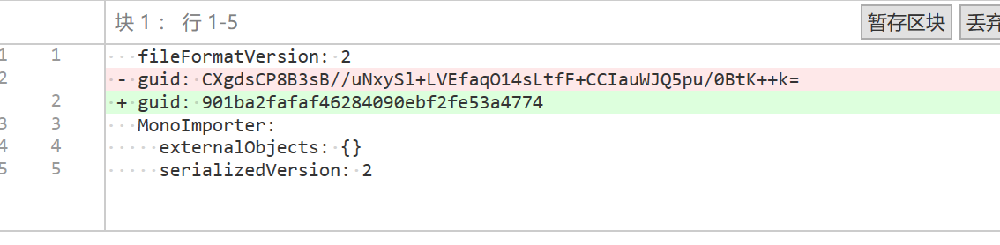

# 工具做了哪些工作

转换工具的入口是：

```text
Tools/团结转Unity/转换GUID并修复资源
```

当前工具主要做三类处理：团结引擎内创建资源的 `.meta` GUID 修复、`AssetDatabase` children 关系修复、`.scene` 场景后缀转换。

## 1. 修复 .meta GUID

在团结引擎内创建的资源。这类资源的 `.meta` 使用团结引擎生成的 GUID，转回 Unity 前需要把这类团结 GUID 修正为 Unity 识别的 GUID，否则 Unity 打开后可能出现引用错乱、资源不可见或资源重新生成 GUID 的问题。

示意图：




## 2. 修复 AssetDatabase children 关系

迁移过程中可能出现这种状态：

- 磁盘上文件夹真实存在。
- `AssetDatabase.IsValidFolder(childPath)` 返回 true。
- 但父文件夹的 `AssetDatabase.GetSubFolders(parentPath)` 没有包含这个 child。

这种情况下，Unity Project 窗口可能不显示该文件夹，虽然资源在磁盘上确实存在。

工具会扫描 `Assets` 目录下所有真实文件夹，对比磁盘子目录和 `AssetDatabase.GetSubFolders` 的结果。如果发现 children 关系缺失，会进行修复


## 3. 将 .scene 改为 .unity

团结场景可以使用 `.scene` 后缀，但 Unity 标准场景使用 `.unity`。实际验证中，`.scene` 改为 `.unity` 后可以由 Unity 正常打开，会同步改 `.meta` 文件名。
