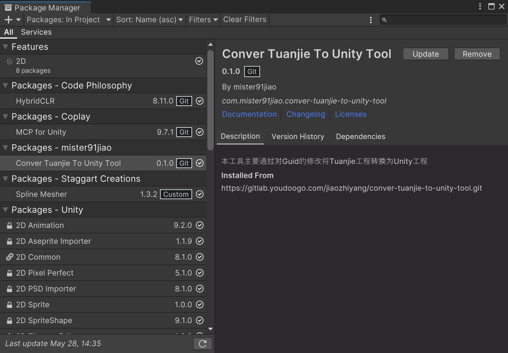

# PackageManager 安装与版本管理

转换工具应先通过团结编辑器的 Package Manager 添加到待转换工程中。工具执行完成后，再用 Unity 打开转换后的工程。

Git 地址是：

```text
https://github.com/mister91jiao/ConverTuanjieToUnity.git
```

## 在团结 Package Manager 中添加

1. 打开团结编辑器。
2. 打开 `Window > Package Manager`。
3. 点击左上角 `+`。
4. 选择 `Add package from git URL...`。
5. 输入转换工具的Git地址


包管理器示意图：


