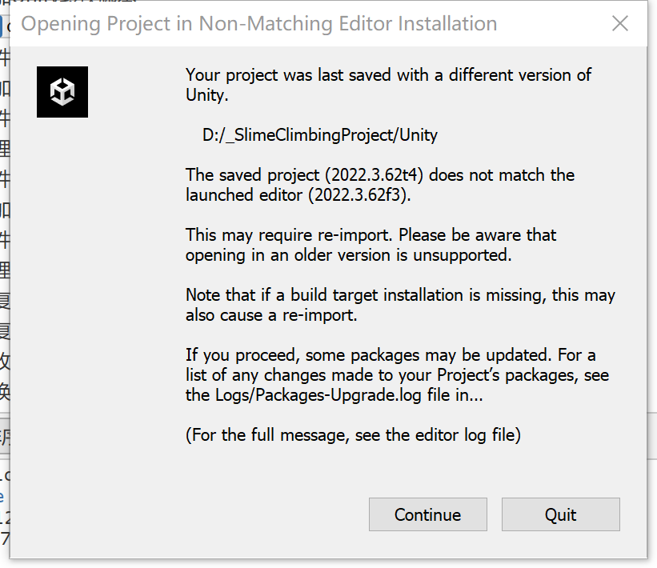
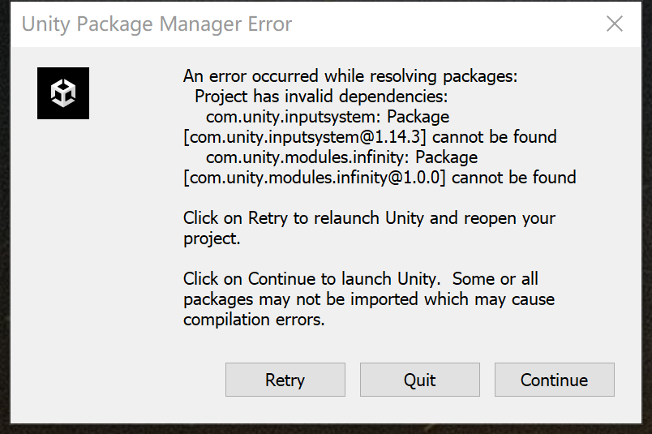
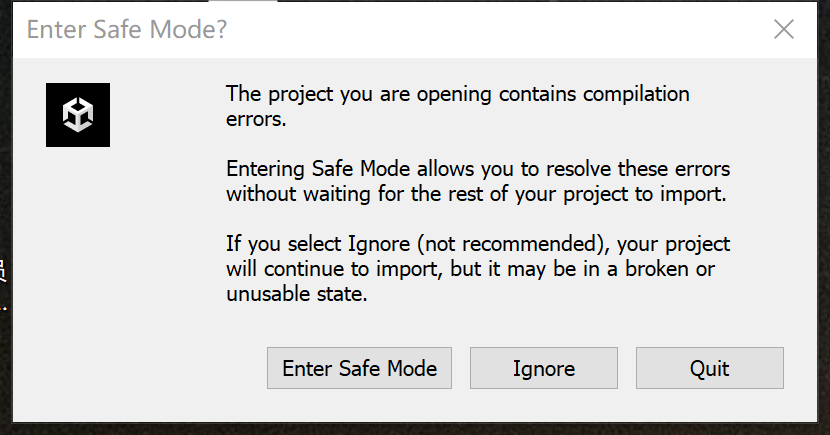
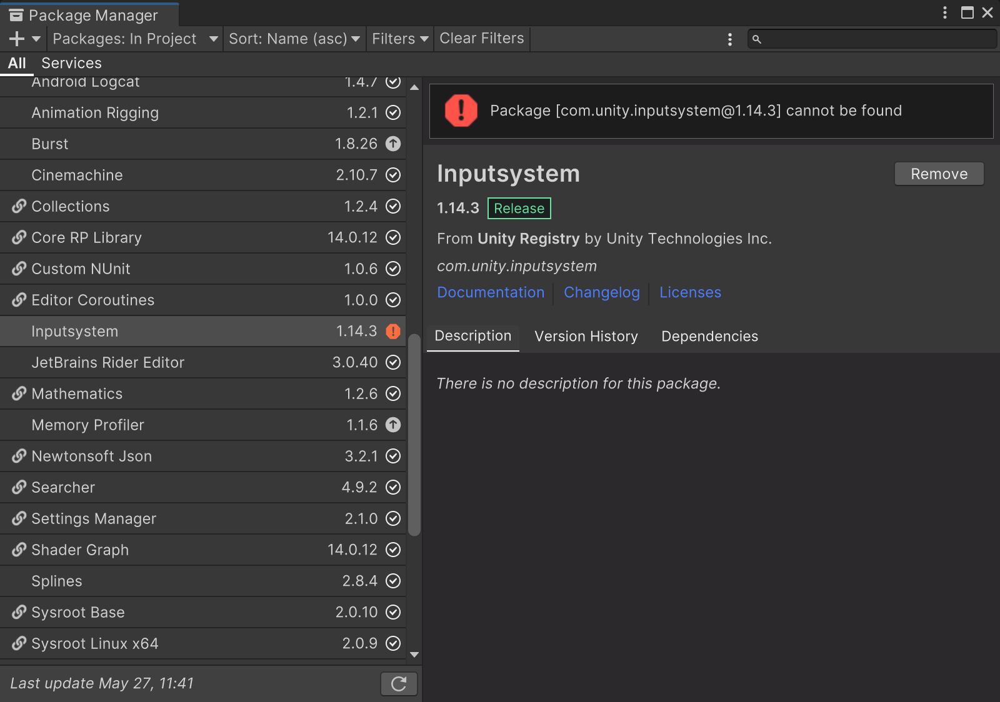

# 转换完成后用 Unity 打开流程

这里的“转换完成后”指已经先在团结内执行转换工具

## 1. 处理 Unity 打开提示

第一次用 Unity 打开已转换工程时，可能出现多次提示或导入错误。处理顺序建议是：先让 Unity 完成基础导入，再处理 Package 和资源导入问题。

打开提示示意图：

提示要切换版本 选 Continue

有一些团结用到的Package包版本和Unity不一样，点 Continue 之后再处理

因为有一些团结用到的Package包版本和Unity不一样会有报错，先 Ignore

## 2. 替换错误的 Package 包

建议处理流程：
1. 打开 `Window > Package Manager`。
2. 检查是否有包解析失败。
3. 对团结专用或错误来源的包执行 remove / re-add。

Package包报错示意图：

