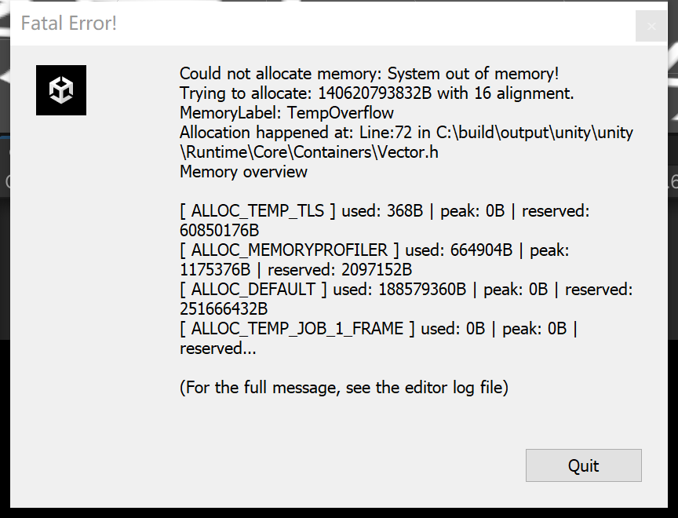
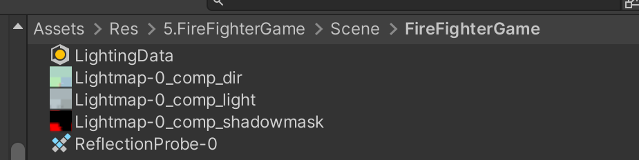
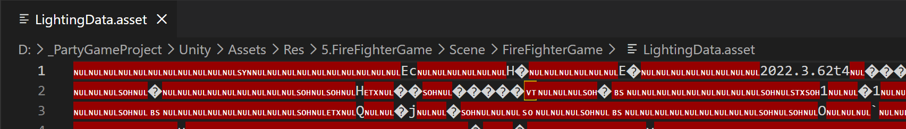
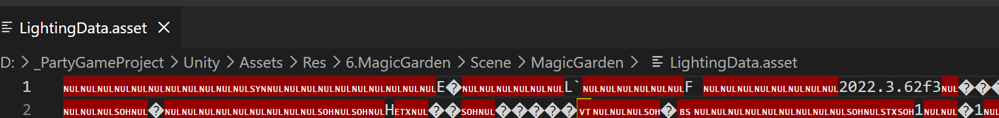

# 重新打包遇到的问题

团结工程迁移到 Unity 后，必须重新打包 AssetBundle

示意图：



## 1. 场景后缀变化导致 加载路径 需要改变后缀

旧场景加载路径：
```text
Assets/Scene/Game.scene
```
改为：
```text
Assets/Scene/Game.unity
```

## 2. LightingData、Lightmap、ReflectionProbe 需要重新烘焙

迁移提交中可以看到多个场景烘焙资源发生变化，包括：

- `LightingData.asset`
- `Lightmap-*_comp_dir.png`
- `Lightmap-*_comp_light.exr`
- `Lightmap-*_comp_shadowmask.png`
- `ReflectionProbe-0.exr`

这些资源在团结和 Unity 之间可能存在序列化差异。需要重新烘焙需要静态光照的场景。

团结引擎 LightingData 示例：

LightingData 资源示例：





Unity 引擎 LightingData 示例：


